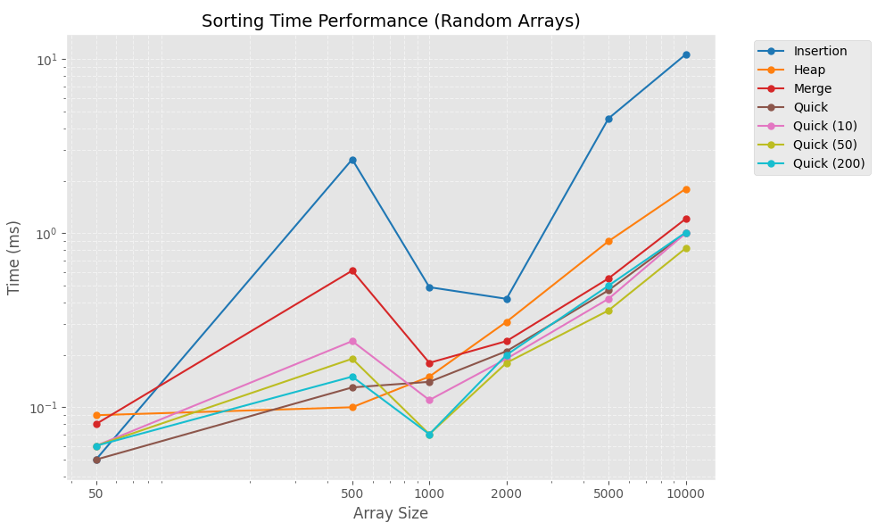

# Assignment 3 Report
Name: `Jonathan Rodriguez`
NetID: `jdr220004`
Section: `501`

## Implementations

### Insertion
- Standard insertion sort implementation with nested loops
- Best: `O(n)`
- Avg and Worst: `O(n^2)`

### Heap
- Standard heap sort with heapify operation
- All cases: `O(nlogn)` --> building the heap takes `O(n)` time and heapify takes `O(logn)` time

### Merge 
- Recursive merge sort using divide and conquer
- All cases: `O(nlogn)` --> divides array in half, `O(logn)`, and regroups it, `O(n)`

### Quick and Cutoff- Median of Three
- Uses the median of three pivot selection on both the normal Quicksort and the cutoff version
- Best and Avg case: `O(nlogn)`
- Worst: `O(n^2)` for normal quicksort and `O(n^2 + k)` for the insertion cutoff

## Graphs

